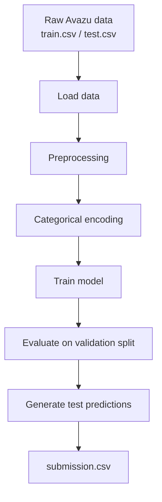

# Click-Through Rate (CTR) Prediction

This project tackles large-scale CTR prediction on a high-cardinality advertising dataset. The pipeline handles data loading, preprocessing, feature encoding, model training, validation, and Kaggle-style prediction export.
CTR prediction is a very common machine learning problem with large, imbalanced, high cardinality datasets. Hence, contained in this repo is a a reproducible CTR prediction pipeline for the Kaggle Avazu dataset.  This repo trains a baseline click-through-rate model from `train.gz`, evaluates it on a validation split, and generates a Kaggle-style submission from `test.gz` and outputs the results to 'predictions.csv'.  The current baseline uses Logistic Regression with preprocessing for numeric and categorical features. 

```md
## ML pipeline



## Summary 

Uses the Avazu CTR Kaggle dataset
Builds a pipeline to:
load and downsample / preprocess high-cardinality categorical features
train a CTR model (LogReg / GBDT / etc.)
evaluate on a validation set using CTR-specific metrics
generate a Kaggle-submittable CSV

## Dataset (Avazu CTR Prediction)

Dataset:
   ~40M training samples
   Highly sparse categorical features
   Binary classification (clicked vs not clicked)
Challenges:
   Extreme class imbalance
   Very high-cardinality categorical variables
   Need for efficient feature encoding

Competition: Avazu Click-Through Rate Prediction (Kaggle)

Download `train.gz` and `test.gz` from the competition page and place them here:

```
data/raw/train.gz
data/raw/test.gz
```

## Approach

Pipeline stages:
Data preprocessing
Feature encoding
Model training
Evaluation
Kaggle submission generation

## Feature Engineering

Key feature transformations:
One-hot encoding / hashing for categorical features
Time-based features derived from timestamp
Feature interaction terms

## Modeling

Baseline model:
Logistic Regression (fast, interpretable)
Additional models tested:
Gradient Boosting (LightGBM / XGBoost)
Evaluation metric:
Log Loss
AUC

## Quickstart


This repository was generated from the notebook **Click Through Rate Prediction Final Submission.ipynb** and organized into a Python package + CLI scripts.
You can keep the original notebook under `notebooks/` and iterate on the modular code in `src/` and `scripts/`.

```bash
git clone https://github.com/wmeikle33/Click-Through-Rate-Prediction.git
cd Click-Through-Rate-Prediction
python -m venv .venv
source .venv/bin/activate
pip install -e ".[data]"
python scripts/download_data.py

## Training different models

### Logistic regression baseline
pip install -e .
ctr-train --csv data/raw/train.csv --label click --model logreg --model-path models/logreg.joblib

pip install -e ".[xgb]"
ctr-train --csv data/raw/train.csv --label click --model xgb --model-path models/xg

## Predict
python scripts/predict.py --model models/model.joblib --input data/raw/test.gz --output predictions.csv

python scripts/submission.py
```

## Project structure

```bash

Click-Through-Rate-Prediction/
├── pyproject.toml
├── pre_commit_config.yaml
├── requirements.txt
├── requirements-dev.txt
├── src/
│   └── ctr_prediction/
│       ├── __init__.py
│       ├── model.py
│       ├── train.py
│       ├── predict.py
│       └── data.py
├── scripts/
│   ├── train.py
│   └── predict.py
├── reports/
├── notebooks/
└── tests/


```

## Notes

- The baseline pipeline uses **Logistic Regression** over a simple preprocessing of numeric/categorical columns.
- Swap in gradient-boosting models (XGBoost/LightGBM) if your notebook relied on them; just update `src/model.py`.
- Keep iterating: move stable logic out of the notebook into `src/` functions.

---

# Results

The original notebook had a binary logloss of 0.3984388029554979.

# Reproduce my Score

```

## Reproduce the baseline

1. Clone the repo
2. Create a virtual environment
3. Install dependencies
4. Put `train.csv` and `test.csv` in `data/raw/`
5. Train the baseline model
6. Generate predictions

```bash
git clone https://github.com/wmeikle33/Click-Through-Rate-Prediction.git
cd Click-Through-Rate-Prediction

python -m venv .venv
source .venv/bin/activate
pip install -e ".[data]"

mkdir -p data/raw
# place train.csv and test.csv in data/raw/

ctr-train --csv data/raw/train.csv --label click --model logreg --model-path models/logreg.joblib
ctr-predict --model models/model.joblib --input data/raw/test.csv --output predict

```
This repository was originally generated from the notebook **Click Through Rate Prediction Final Submission.ipynb** and organized into a Python package + CLI scripts. You can keep the original notebook under `notebooks/` and iterate on the modular code in `src/` and `scripts/`.
